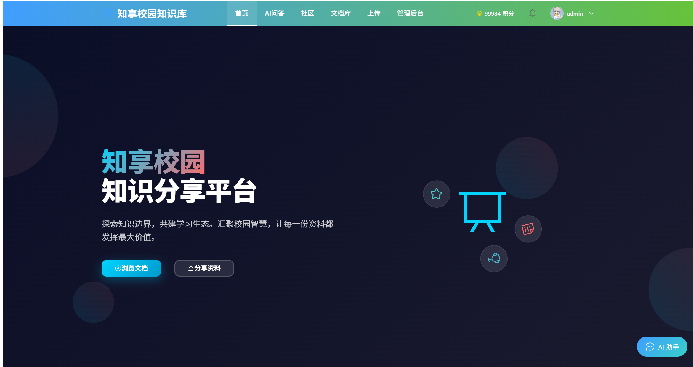
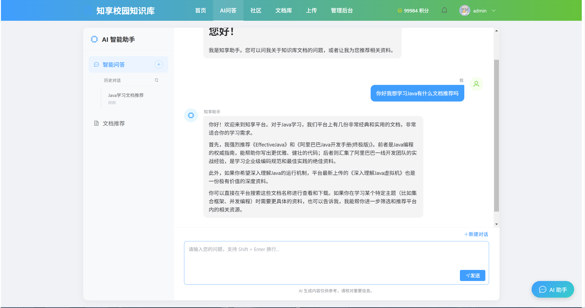
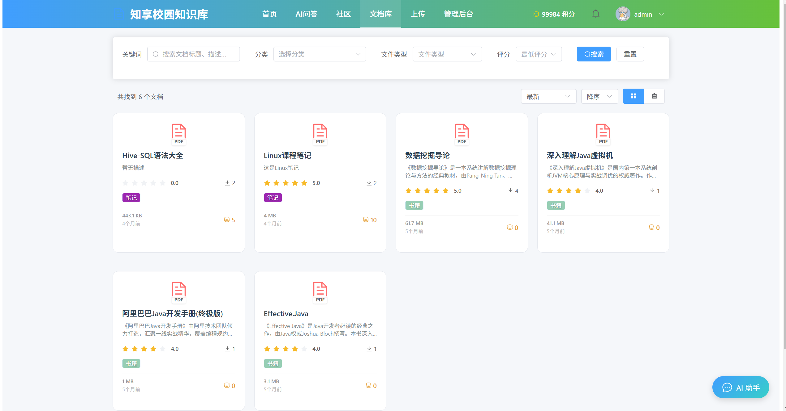
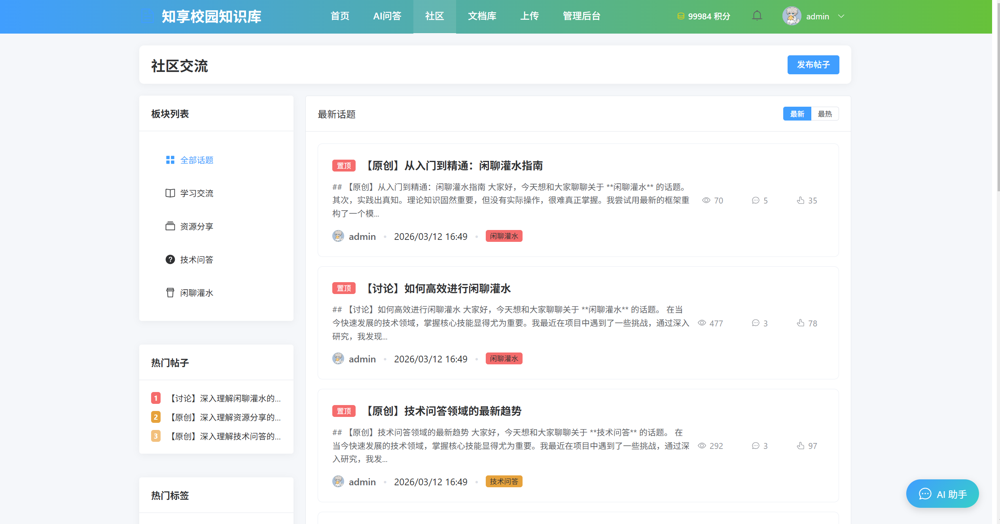
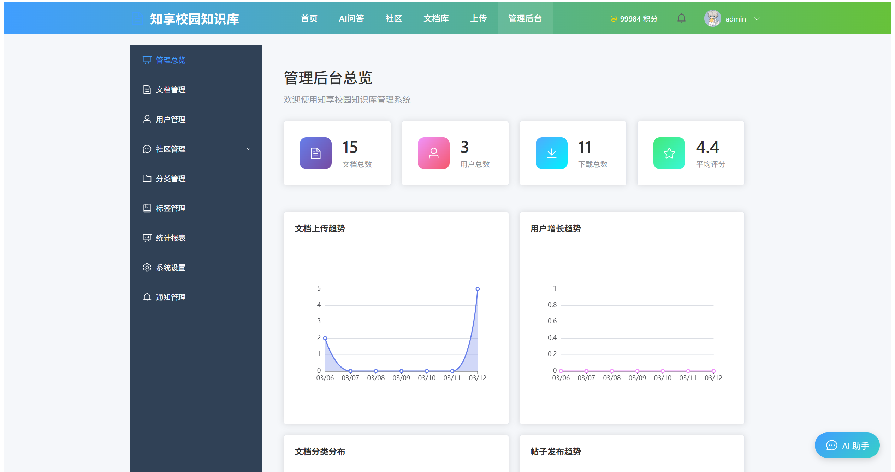
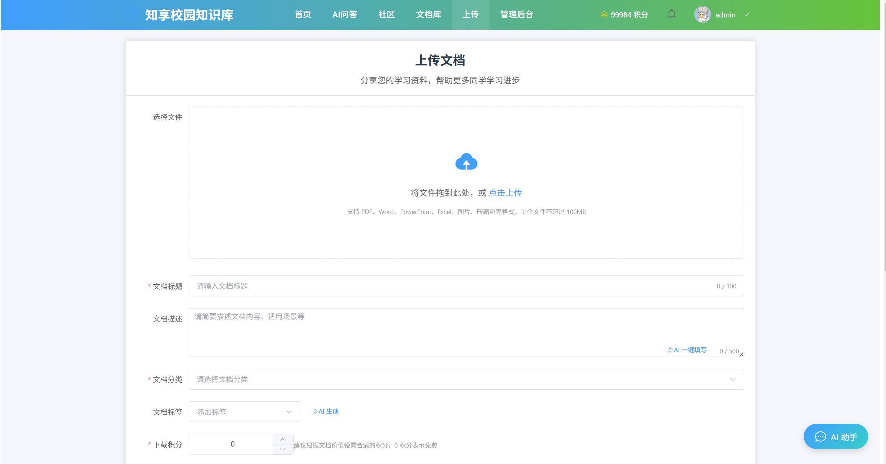

# 知享 - 校园知识库共享平台

**基于 Spring Boot + Vue3 的校园知识共享与智能检索系统**

    

## 📋 项目简介

知享是一个面向高校师生的知识库共享平台，旨在解决校园内学习资料分散、检索困难、分享激励不足等问题。系统实现了文档上传审核、积分激励结算、实时消息通知、社区交流及基于向量模型的智能文档检索，为校园知识共享提供完整的技术解决方案。

> 本项目为本科毕业设计，前后端分离架构，独立设计与实现。

## 🖼️ 功能预览

| 首页 | AI 智能助手 |
|:---|:---|
|  |  |

| 文档库 | 社区交流 |
|:---|:---|
|  |  |

| 管理后台 | 上传文档 |
|:---|:---|
|  |  |

## 🏗️ 系统架构

┌─────────────────────────────────────────────────────────────┐
│                        前端层 (Vue 3)                        │
│         Element Plus · TypeScript · Axios · WebSocket         │
└─────────────────────────────────────────────────────────────┘
                              │
┌─────────────────────────────────────────────────────────────┐
│                      网关/控制层                              │
│         JWT认证 · RBAC鉴权 · 全局异常处理 · 接口文档            │
└─────────────────────────────────────────────────────────────┘
                              │
┌─────────────────────────────────────────────────────────────┐
│                      业务服务层                                │
│  用户认证 │ 文档管理 │ 积分结算 │ 审核流程 │ 实时通知 │ AI检索  │
└─────────────────────────────────────────────────────────────┘
                              │
┌─────────────────────────────────────────────────────────────┐
│                      数据/基础设施层                           │
│       MySQL 8.0    ·    Redis    ·   bge-large-zh 向量模型    │
└─────────────────────────────────────────────────────────────┘

## ✨ 核心功能与技术亮点

1. JWT 双 Token 无感刷新认证
   - Access Token（15分钟）+ Refresh Token（7天）双 Token 机制
   - 集成 BCryptPasswordEncoder 实现密码加密存储
   - 登录失败次数监控：5次失败锁定30分钟，防范暴力破解

2. RBAC 方法级权限控制
   - 基于 @EnableMethodSecurity 开启方法级安全
   - 通过 @PreAuthorize 注解实现接口细粒度鉴权
   - SecurityFilterChain 配置匿名/认证访问白名单

3. 积分激励与数据一致性
   - 设计积分流水表记录变更明细
   - 基于 @Transactional 管理上传奖励、下载扣减等积分结算事务
   - 业务层校验实现每日积分上限50分与持有上限10000分

4. 文档审核与实时通知
   - 文档状态流转：PENDING → APPROVED / REJECTED
   - 审核通过后自动触发积分奖励
   - 基于 WebSocket (STOMP) 向用户私有消息队列推送审核结果
   - 前端实时接收并更新未读消息计数

5. AI 智能文档检索（RAG）
   - 基于 bge-large-zh 向量模型实现文档向量化
   - 向量相似度检索 + 上下文窗口限制
   - 对接大语言模型接口实现智能问答与文档推荐

6. 社区交流模块
   - 支持板块分类、帖子发布、评论互动
   - 置顶帖与热门帖排序展示
   - 浏览量、评论数、点赞数统计

7. 统一工程规范
   - @ControllerAdvice 全局异常捕获，统一返回格式
   - 集成 Knife4j 生成在线接口文档
   - 统一封装 ResultVo 与 PageResponseVo 规范响应结构

## 🛠️ 技术栈

| 层级 | 技术选型 |
|:---|:---|
| 后端框架 | Spring Boot 3.5.5, Spring Security, Spring AI |
| ORM/数据 | JPA, MyBatis-Plus, MySQL 8.0 |
| 缓存/消息 | Redis, WebSocket (STOMP) |
| 安全 | JWT, BCrypt, 登录锁定策略 |
| 前端 | Vue 3, TypeScript, Element Plus |
| 工具链 | Maven, Knife4j, JMeter, Git |

## 📁 项目结构

knowledge_platform/
├── knowledge_platform-backend/     # Spring Boot 后端服务
│   ├── src/main/java/com/example/knowledge_platform/
│   │   ├── config/                 # 安全配置、WebSocket配置
│   │   ├── controller/             # RESTful 接口层
│   │   ├── service/                # 业务逻辑层
│   │   ├── entity/                 # 数据实体
│   │   ├── security/               # JWT、RBAC 实现
│   │   └── websocket/              # 实时通知服务
│   └── src/main/resources/
│       ├── db/                     # 数据库初始化脚本
│       └── application.yml         # 配置文件
├── knowledge_platform-frontend/    # Vue3 前端项目
│   ├── src/views/                  # 页面组件
│   ├── src/api/                    # 接口请求封装
│   └── src/components/             # 公共组件
└── docs/                           # 设计文档与截图
    ├── images/                     # 功能截图
    ├── db/                         # ER图、建表脚本
    └── design.md                   # 设计文档

## 🚀 快速开始

环境要求：JDK 21+、MySQL 8.0+、Node.js 18+、Maven 3.8+

1. 初始化数据库
   创建数据库并导入初始化脚本：
   mysql -u root -p < knowledge_platform-backend/src/main/resources/db/schema.sql

2. 启动后端服务
   cd knowledge_platform-backend
   修改 application.yml 中的数据库密码、邮箱授权码
   mvn spring-boot:run
   （或打包后运行：mvn package && java -jar target/*.jar）

3. 启动前端服务
   cd knowledge_platform-frontend
   npm install
   npm run dev

4. 访问系统
   - 前端地址：http://localhost:5173
   - 后端接口：http://localhost:8080
   - 接口文档：http://localhost:8080/doc.html（Knife4j）

## 📄 相关文档

- 接口文档：http://localhost:8080/doc.html（Knife4j 在线文档）
- 数据库设计：./docs/db/（ER图与建表脚本）
- 系统设计文档：./docs/design.md（架构选型与核心流程说明）

## 📌 更新日志

v1.0.0 (2026-04)
- 完成用户认证模块：JWT双Token、登录锁定、邮箱验证
- 完成RBAC权限控制：角色枚举、方法级鉴权、安全白名单
- 完成文档管理：上传、审核、下载、积分结算
- 完成实时通知：WebSocket点对点推送、广播消息
- 完成社区交流：板块分类、帖子发布、评论互动
- 完成AI智能检索：向量索引构建、相似度搜索、文档推荐
- 集成Knife4j接口文档与全局异常处理

---

📫 联系我
邮箱：2508281265@qq.com | 求职意向：Java后端开发
